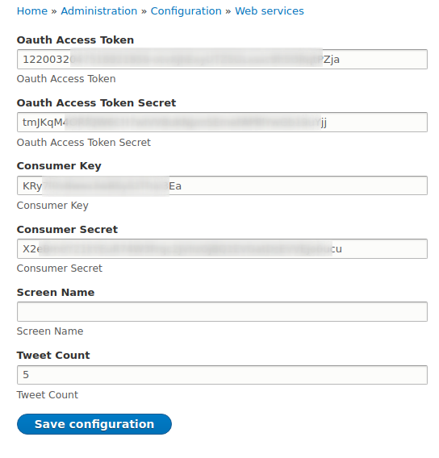
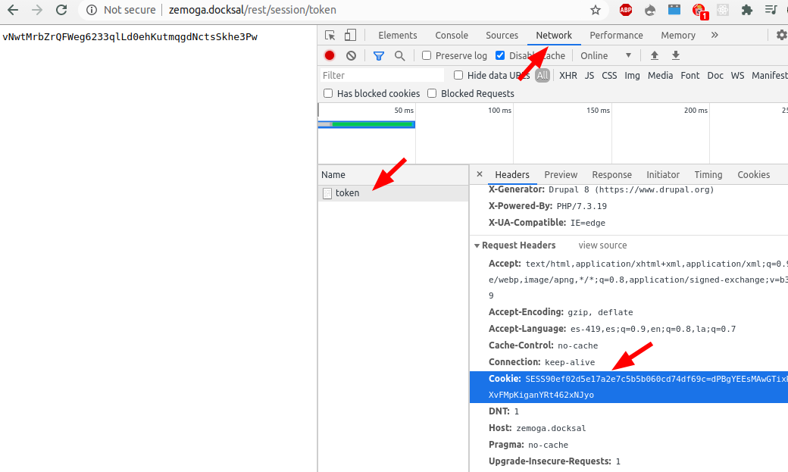

For running this code I recommend using Docksal or a similar application to install a new instance of Drupal 8.

## Docksal installation:

https://docksal.io/installation/

## Drupal installation:

### Using Docksal

```
$ fin create project

Enter your choice(0-18): 5     #5.  Drupal 8 (Composer Version)
Do you wish to proceed? [y/n]: y

$ cd d8
$ fin up
$ fin drush uli                # Logged admin user link
```

### Using composer

```
$ composer create-project drupal/recommended-project d8
$ cd d8
```

## Install core and contrib modules

### Using docksal:

```
$ fin composer require drupal/twitter_tweets
$ fin drush en twitter_tweets
$ fin drush en rest
```

## Install custom module:

```
$ mkdir web/modules/custom
$ cd web/modules/custom
$ git clone ...
$ fin drush en zprofile
```

## Importing after installation settings:

```
$ fin drush cim -y --partial --source=/var/www/web/modules/custom/zprofile/config/after_install
```

## Twitter settings:

Navigate to `/admin/config/services/twitter-settings` and fill out the Twitter API keys.

<p align="center">
  
</p>

## Profile data:

Navigate to `/admin/structure/user_profile` and add a new user profile entity.

# Rest Endpoints:

## get the Session Cookie

Use developer tools to get the current session cookie.

<p align="center">
  
</p>

## Get the Session token

Navigate to `/rest/session/token`

## Get profile:

Replace the Domain name and Session Cookie in the next command.

```bash
curl --location --request GET 'http://[YOUR_DOMAIN_HERE]/api/v1/profiles/1?_format=json' \
--header 'Cookie: [SESSION_COOKIE_HERE]' \
--header 'Content-Type: application/json' \
```

## Update profile (PATCH)

Replace the Domain name, Session Cookie and the Session token in the next command.

```bash
curl --location --request PATCH 'http://[YOUR_DOMAIN_HERE]/api/v1/profiles/1?_format=json' \
--header 'Cookie: [SESSION_COOKIE_HERE]' \
--header 'X-CSRF-Token: [SESSION_TOKEN_HERE]' \
--header 'Content-Type: application/json' \
--data-raw '{
    "type": [
        {
            "target_id": "default_profile"
        }
    ],
    "field_description": [
        {
            "value": "<p>This is the new description</p>\r\n",
            "format": "basic_html",
            "processed": "<p>This is the new description</p>"
        }
    ]
}'
```
